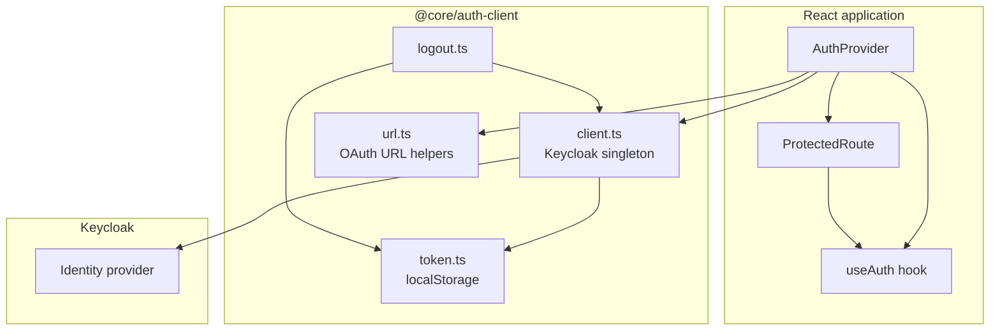
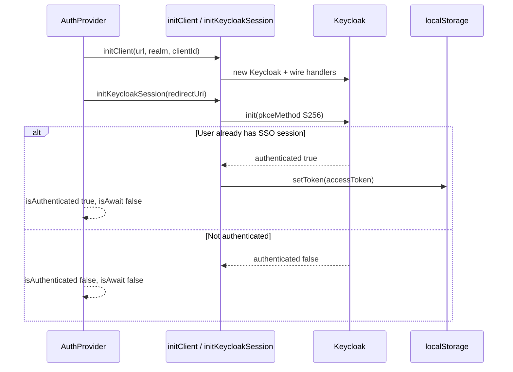
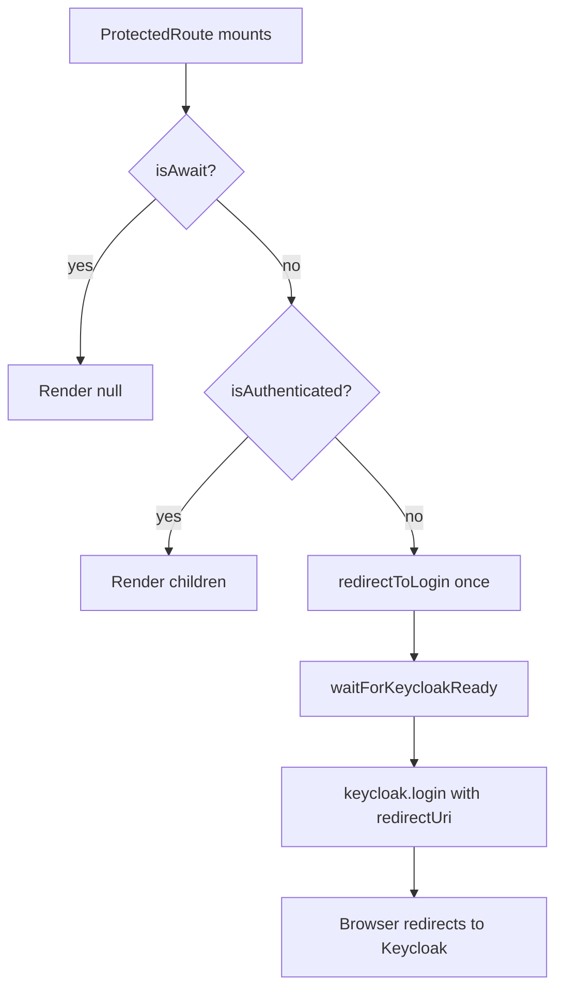
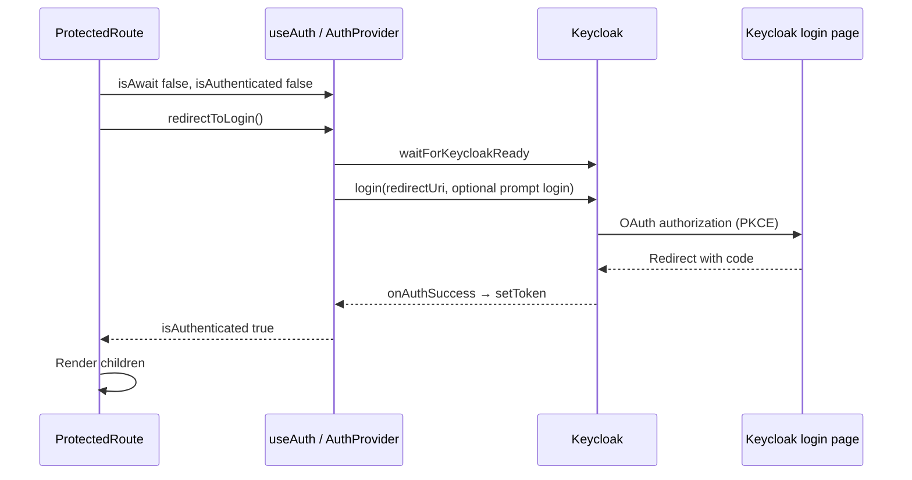
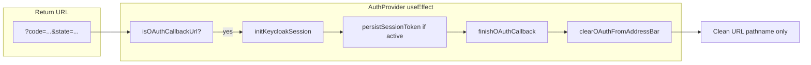
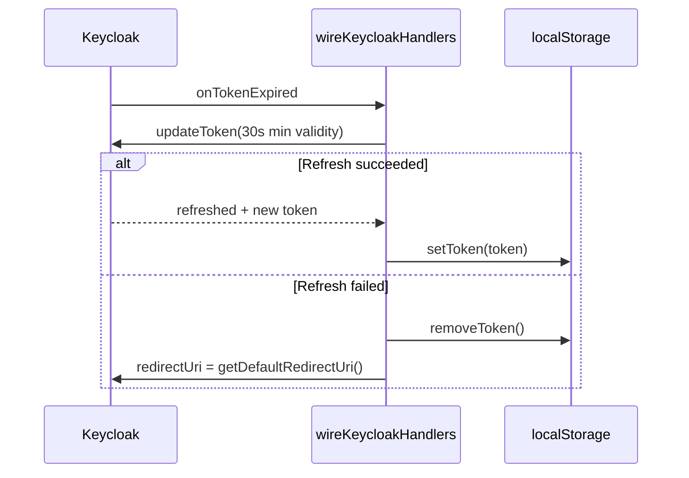
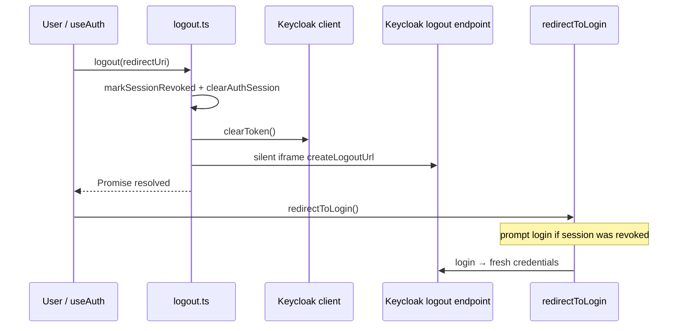
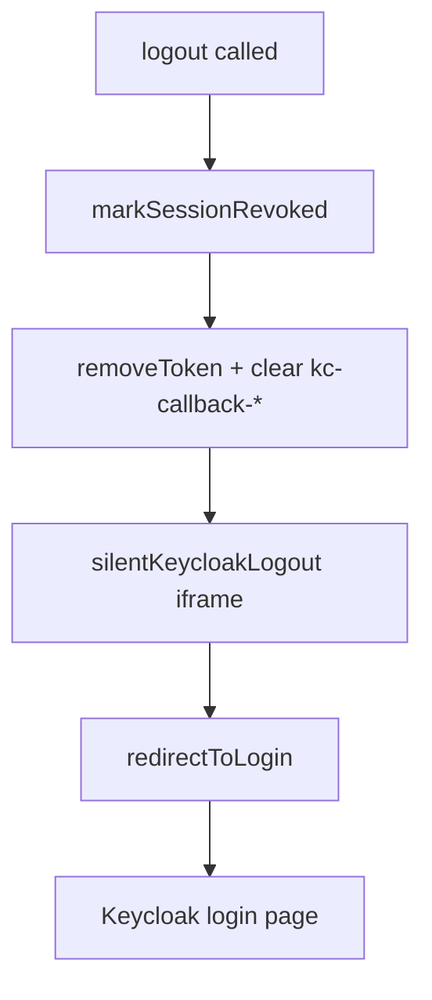

# @core/auth-client

React authentication client for Keycloak. Wraps `keycloak-js` with a shared singleton client, PKCE login, token persistence in `localStorage`, route protection, and silent SSO logout.

## Installation

Add the local package to your app:

**`package.json`**

```json
{
  "dependencies": {
    "@core/auth-client": "^1.0.0"
  }
}
```

**`tsconfig.json`**

```json
{
  "references": [
    { "path": "../../packages/auth-client" }
  ]
}
```

**Peer dependencies:** `react` (>=19), `react-dom` (>=19), `react-router` (^7.6).

## Quick start

```tsx
import { useMemo } from 'react';
import useAuth, { AuthProvider, ProtectedRoute } from '@core/auth-client';

const redirectUri = `${window.location.origin}/dashboard`;

export default function DashboardPage() {
  return (
    <AuthProvider
      providerUrl="https://auth.example.com"
      realm="my-realm"
      clientId="my-spa"
      redirectUri={redirectUri}
    >
      <ProtectedRoute>
        <DashboardContent />
      </ProtectedRoute>
    </AuthProvider>
  );
}

function DashboardContent() {
  const [{ token, isAuthenticated }, { logout, changePassword }] = useAuth();

  if (!isAuthenticated) return null;

  return (
    <section>
      <p>Authenticated</p>
      <button type="button" onClick={() => changePassword()}>Change password</button>
      <button type="button" onClick={() => logout()}>Logout</button>
    </section>
  );
}
```

## Package structure

| Module | Role |
|--------|------|
| `client.ts` | Keycloak singleton, init, PKCE, token refresh handlers |
| `Context.tsx` | `AuthProvider`, `useAuth` hook |
| `ProtectedRoute.tsx` | Redirect unauthenticated users to login |
| `token.ts` | Persist access token in `localStorage` (`auth_token`) |
| `url.ts` | OAuth callback detection and URL cleanup |
| `logout.ts` | Silent iframe logout and session revoke flag |
| `change-password.ts` | Keycloak `UPDATE_PASSWORD` redirect |

## Architecture



## Authentication flows

### 1. App mount and session restore

When `AuthProvider` mounts, it initializes the shared Keycloak client (once per config), restores or completes the OAuth session, and exposes state via context.



### 2. Protected route → login redirect

`ProtectedRoute` waits until `isAwait` is false. If the user is not authenticated, it calls `redirectToLogin()` once.





### 3. OAuth callback handling

After Keycloak redirects back with `code`, `state`, etc., the provider detects the callback, finishes init, then strips OAuth params from the address bar.



### 4. Access token refresh

Keycloak fires `onTokenExpired`; the client refreshes the token and updates `localStorage`. On failure it clears the token and sets `redirectUri` for the next login.



### 5. Logout

Logout marks the session as revoked (also in `sessionStorage`), clears local tokens and Keycloak callback storage, silently ends the Keycloak SSO session in a hidden iframe, then redirects to login.





## API

### `AuthProvider`

| Prop | Type | Required | Description |
|------|------|----------|-------------|
| `providerUrl` | `string` | yes | Keycloak base URL |
| `realm` | `string` | yes | Realm name |
| `clientId` | `string` | yes | SPA client ID |
| `redirectUri` | `string` | no | Post-login redirect; defaults to current origin + pathname without OAuth params |

### `useAuth()` → `[state, actions]`

**State**

| Field | Type | Description |
|-------|------|-------------|
| `token` | `string \| null` | Access token when authenticated |
| `isAuthenticated` | `boolean` | User has a valid Keycloak session and session is not revoked |
| `isAwait` | `boolean` | Initial Keycloak init in progress |

**Actions**

| Method | Description |
|--------|-------------|
| `redirectToLogin()` | Ensures Keycloak is ready, then starts login (forces `prompt: login` if session was revoked) |
| `logout()` | Clears local session, silent Keycloak logout, then `redirectToLogin()` |
| `changePassword()` | Ensures Keycloak is ready, then starts the `UPDATE_PASSWORD` login action |

### `ProtectedRoute`

Renders `children` only when `isAuthenticated` is true. Shows nothing while `isAwait` or while redirecting to login.

### Low-level exports

The default export is `useAuth`. Named exports: `AuthProvider`, `ProtectedRoute`, `AuthContextType`.

Internal modules (`client`, `logout`, `url`, `token`) are used by the provider; import them only if you extend behavior in the monorepo.

## Configuration notes

- **PKCE:** Init uses `pkceMethod: 'S256'` and `checkLoginIframe: false`.
- **Redirect URI:** Should match a valid redirect URI in the Keycloak client; use a stable path without OAuth query strings.
- **Session revoked flag:** Stored in `sessionStorage` as `auth_client_session_revoked` so a forced logout requires re-entering credentials on next login.
- **Token storage:** Access token key is `auth_token` in `localStorage` for API calls from the host app.

## Scripts

```bash
npm run build      # Compile TypeScript
npm run start:dev  # Watch mode
npm run test       # Jest
npm run eslint     # Lint src
```

## License

ISC
